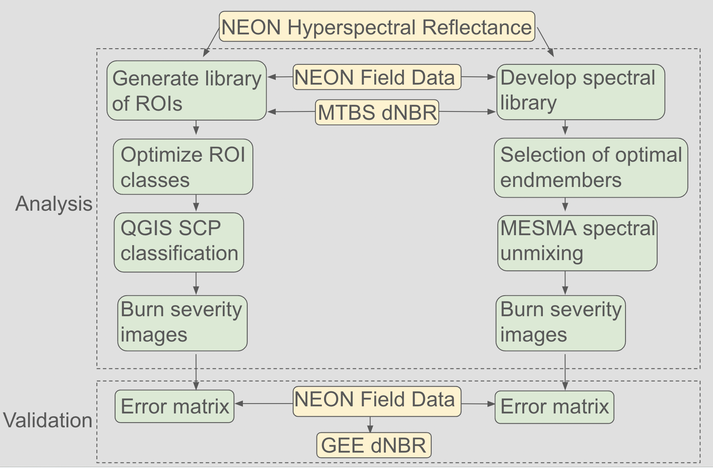

# Spectral Analysis of Post-wildfire Recovery
This is a research project using spectral analysis to study post-wildfire recovery. To learn more about the Chimney Tops 2 Fire and background for this work, please see our [previous work](https://github.com/AreteY/post-wildfire-recovery).

# Data Sources
## Raster data
1. [NEON Spectrometer Reflectance](https://data.neonscience.org/data-products/DP3.30006.001)
* **Reference:** National Ecological Observatory Network. Spectrometer orthorectified surface directional reflectance - mosaic (DP3.30006.001), RELEASE-2022. https://doi.org/10.48443/5er3-8n49. Dataset accessed from https://data.neonscience.org on April 15, 2022.
2. [MTBS Difference Normalized Burn Ratio](https://mtbs.gov/direct-download)
* **Reference:** Monitoring Trends in Burn Severity Data Access: 30m dNBR image subset (based on Landsat 8 Reflectance). (2019, May - last revised). MTBS Project (USDA Forest Service/U.S. Geological Survey). Dataset accessed from http://mtbs.gov/direct-download on April 26, 2022.
3. [GEE Landsat Difference Normalized Burn Ratio](https://developers.google.com/earth-engine/datasets/catalog/landsat)
* **Reference:** Google Earth Engine Landsat Collection. Mean Composite Fire Severity Metrics computed using method from https://doi.org/10.3390/rs10060879. Dataset accessed from https://developers.google.com/earth-engine/datasets/catalog/landsat on October 17, 2023.

## Tabular data
4. [NEON Plant Presence and Percent Cover](https://data.neonscience.org/data-products/DP1.10058.001)
* **Reference:** NEON (National Ecological Observatory Network). Plant presence and percent cover (DP1.10058.001), RELEASE-2022. https://doi.org/10.48443/pr5e-1q60. Dataset accessed from https://data.neonscience.org on April 18, 2022.

## Vector data
5. Chimney Tops 2 Fire Perimeter
* **Reference:** MTBS Data Access: Fire Level Geospatial Data. (2022, February - last revised). MTBS Project (USDA Forest Service/U.S. Geological Survey). Available: https://mtbs.gov/direct-download. Data accessed April 3, 2022.
* Available for download from [previous repository](https://github.com/AreteY/post-wildfire-recovery) as [Release v1.0.0](https://github.com/AreteY/post-wildfire-recovery/releases) `chimtops2-boundary`
6. Great Smoky Mountains National Park Perimeter
* **Reference:** National Park Service- Land Resources Division. Great Smoky Mountains National Park Boundary. (December 30, 2019 - last revised). Available: https://grsm-nps.opendata.arcgis.com. Data accessed March 28, 2022.
* Available for download from [previous repository](https://github.com/AreteY/post-wildfire-recovery) as [Release v1.0.1](https://github.com/AreteY/post-wildfire-recovery/releases) `grsm-boundary`
7. [NEON Terrestrial Observation System Sampling Locations](https://www.neonscience.org/data-collection/terrestrial-plants)
* **Reference:** NEON Document Library: Spatial Data. (June 29, 2020 - last revised). Available: https://data.neonscience.org/documents. Data accessed April 18, 2022.
* Available for download in [previous repository](https://github.com/AreteY/post-wildfire-recovery) as [Release v1.0.2](https://github.com/AreteY/post-wildfire-recovery/releases) `neon-tos-plot-centroids`

# Workflow

# License
The post-wildfire-recovery project is under the [MIT License](https://github.com/AreteY/post-wildfire-spectral-analysis/blob/main/LICENSE).
